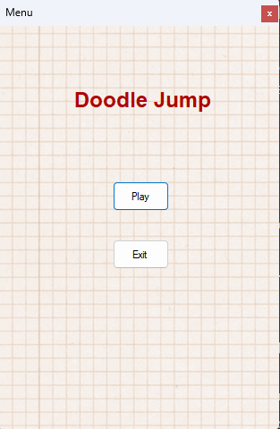
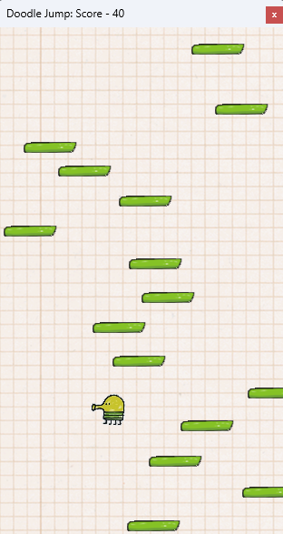
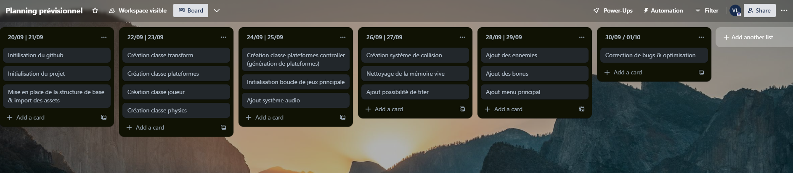
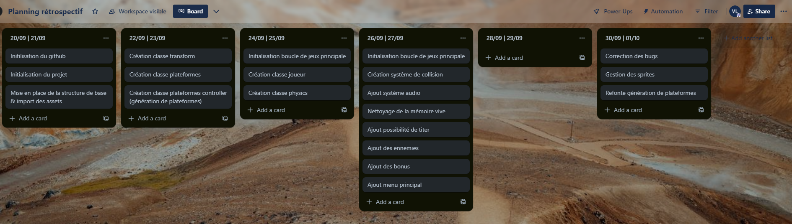

# Doodle Jump WFA
Ce projet est un jeu Doodle Jump créé par [**Valentin LAMINE**](http://github.valentinlamine.fr) dans le cadre du projet scolaire C# WFA PROJECT visant à créer un jeu en utilisant la technologie **Windows Form Application C#**.

## Présentation du projet
Dans mon cas j'ai décidé de recréer un Doodle Jump de toutes pièces, en s'inspirant de certains tutoriels comme bases j'ai ensuite construit des fonctionnalités clés afin de représenter le plus fidèlement possible le jeu.  

### Fonctionnalités du jeu
* Génération et nettoyage de plateforme en temps réel, rendant le jeu infini
* Des ennemies et des bonus pour plus de fun
* Un système sonore complet et fidèle au jeu d'origine
* Une gestion des sprites, collisions et physiques des plus fidèles.

## Screenshots
 

## Comment jouer
* Utilisez les **flèches directionnelles** pour vous déplacer
* Appuyez sur la touche **espace** pour tirer

## Installation
* Téléchargez le projet
* Ouvrez le projet dans **Visual Studio**
* Compilez le projet
* Lancez le projet

## Lancer le projet
```bash
$ dotnet run
```
Attention, le projet ne fonctionne que sur Windows et nécessite .NET Framework 4.7.2

## Gestion de projet
Dans le cadre de ce projet, j'ai utilisé la méthode **SCRUM** afin de gérer le projet, j'ai donc utilisé **Trello** pour gérer mes tâches. Mes backlogs sont divisé en durée de 2 jours.

### Planning prévisionnel


### Planning rétrospectif
